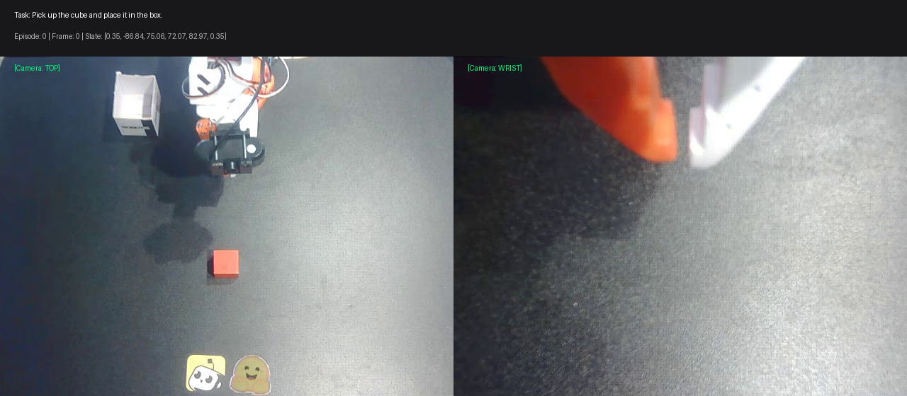

<div align="center">

# 🦾 SmolVLA: Vision-Language-Action Policy for Low-Cost Robotics

[](https://colab.research.google.com/github/chalee88/SmolVLA/blob/main/notebooks/smolvla_so100_finetuning.ipynb)
[](https://huggingface.co/lerobot/smolvla_base)
[](https://huggingface.co/datasets/lerobot/svla_so100_pickplace)
[](https://github.com/huggingface/lerobot)
[](LICENSE)

A compact, reproducible repository for training, inspecting, and deploying **SmolVLA** (a 450M parameter Vision-Language-Action model) on the open-source **SO-100** robotic arm.

<br>



</div>

---

## 📌 Overview

**SmolVLA** is an efficient and accessible Vision-Language-Action (VLA) foundation model developed by Hugging Face. Designed specifically for low-cost, real-world robotics:

- **Compact Parameter Footprint (~450M parameters)**: Can be fine-tuned on affordable consumer GPUs (including free-tier Google Colab T4 GPUs) and run at fast inference rates.
- **Multimodal Conditioning**: Combines natural language task instructions with dual visual streams (**Top-down workspace camera** + **Wrist gripper camera**).
- **Flow Matching Action Expert**: Predicts smooth 6-DoF continuous motor joint trajectories for the SO-100 robotic arm.

---

## 📁 Repository Structure

```
SmolVLA/
├── smolvla/                           # Core SmolVLA policy implementation
│   ├── configuration_smolvla.py       # Configuration and hyperparameter definitions
│   ├── modeling_smolvla.py            # SmolVLAPolicy neural network architecture
│   ├── processor_smolvla.py           # Pre/post-processing pipelines
│   └── smolvlm_with_expert.py         # SmolVLM vision backbone + action expert
├── common/                            # Flow matching & VLA utilities
│   ├── flow_matching.py               # Euler integration & beta time sampling
│   └── vla_utils.py                   # Sinusoidal embeddings & attention masks
├── assets/
│   └── sample_visualization.png       # Annotated dual-camera visual sample
├── notebooks/
│   └── smolvla_so100_finetuning.ipynb # Complete Google Colab fine-tuning pipeline
├── scripts/
│   ├── inspect_dataset.py             # Inspect feature shapes, episode counts, and task labels
│   ├── visualize_sample.py            # Stitch & annotate dual camera frames with joint angles
│   └── predict_sample.py              # Test offline action trajectory inference on CPU/GPU
├── .gitignore                         # Configured to ignore large checkpoints & logs
├── requirements.txt                   # Minimal Python environment requirements
└── README.md                          # Project documentation
```

---

## 🚀 Quickstart

### 1. Installation

Clone this repository and install the required dependencies:

```bash
git clone https://github.com/chalee88/SmolVLA.git
cd SmolVLA

# Create and activate virtual environment
python -m venv .venv
source .venv/bin/activate  # On Windows: .venv\Scripts\activate

# Install dependencies
pip install -r requirements.txt
```

> **Note:** SmolVLA utilizes the core policy architecture from [`lerobot`](https://github.com/huggingface/lerobot). Ensure `ffmpeg` is installed on your system for video frame decoding:
> - Ubuntu/Debian: `sudo apt-get install ffmpeg`
> - macOS: `brew install ffmpeg`
> - Windows: `winget install Gyan.FFmpeg` or `choco install ffmpeg`

---

### 2. Inspect Dataset

Verify your dataset connection and inspect episode counts, task instructions, and feature tensors:

```bash
python scripts/inspect_dataset.py
```

Optional arguments:
```bash
python scripts/inspect_dataset.py --repo_id lerobot/svla_so100_pickplace --sample_idx 10
```

---

### 3. Visualize Multi-Camera Observations

Generate a side-by-side composite image from the dataset showing the top-down and wrist camera views annotated with the robot's motor states:

```bash
python scripts/visualize_sample.py
```

The output will be saved to `sample_visualization.png`.

---

### 4. Run Policy Inference (Predict Action Chunks)

Run a test forward pass using the pre-trained `lerobot/smolvla_base` model to predict 6-DoF motor joint target trajectories:

```bash
python scripts/predict_sample.py
```

Output:
```
Using device: CUDA (or CPU)
1. Loading dataset sample from 'lerobot/svla_so100_pickplace'...
2. Loading SmolVLA model from 'lerobot/smolvla_base'...
3. Setting up pre/post processing pipelines...
4. Preprocessing input sample...
5. Predicting action chunk with SmolVLA...

=============================================
        PREDICTION SUCCESSFUL!
=============================================
Task Instruction: 'Pick up the cube and place it in the box.'
Action Chunk Shape: torch.Size([50, 6]) (timesteps x motor DOFs)

Predicted 6-DoF Motor Angles (First 3 Timesteps in degrees):
tensor([[ 18.234, -32.114,  45.021, -12.441,  88.192,  10.021],
        [ 18.552, -31.890,  45.312, -12.215,  88.250,  10.021],
        [ 18.910, -31.541,  45.701, -11.980,  88.310,  10.021]])
```

---

## 🎯 Fine-Tuning SmolVLA

### Option A: Google Colab (Recommended for Free GPU)

Click the badge to open the interactive notebook directly in Google Colab:

[](https://colab.research.google.com/github/chalee88/SmolVLA/blob/main/notebooks/smolvla_so100_finetuning.ipynb)

The notebook guides you through:
1. Environment setup and GPU verification.
2. Dataset loading and inspection.
3. Fine-tuning the action expert on 50 SO-100 pick-and-place demonstration episodes.
4. Testing action generation on unseen validation frames.
5. Exporting and downloading the fine-tuned checkpoint.

---

### Option B: Local Training via CLI

If you have a local NVIDIA GPU (>= 12GB VRAM recommended):

```bash
python -m lerobot.scripts.lerobot_train \
  --policy.path=lerobot/smolvla_base \
  --dataset.repo_id=lerobot/svla_so100_pickplace \
  --rename_map='{"observation.images.top": "observation.images.camera1", "observation.images.wrist": "observation.images.camera2"}' \
  --batch_size=8 \
  --steps=10000 \
  --save_freq=2500 \
  --output_dir=outputs/train/smolvla_so100 \
  --job_name=smolvla_so100_run \
  --policy.device=cuda \
  --policy.freeze_vision_encoder=true \
  --wandb.enable=false
```

---

## 📚 References & Citation

If you use SmolVLA or this repository in your research, please cite the original paper:

```bibtex
@article{shukor2025smolvla,
  title={SmolVLA: A Vision-Language-Action Model for Affordable and Efficient Robotics},
  author={Shukor, Mustafa and Aubakirova, Dana and Capuano, Francesco and Kooijmans, Pepijn and Palma, Steven and Zouitine, Adil and Aractingi, Michel and Pascal, Caroline and Russi, Martino and Marafioti, Andres and Alibert, Simon and Cord, Matthieu and Wolf, Thomas and Cadene, Remi},
  journal={arXiv preprint arXiv:2506.01844},
  year={2025}
}
```

---

## 📄 License

This repository is licensed under the Apache 2.0 License.
